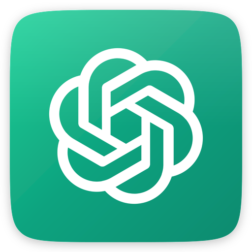

<p align="center">
  
</p>

<h1 align="center">ChatGPT Desktop App</h1>

<p align="center">
  <strong>A beautiful native desktop application for <a href="https://chatgpt.com/">ChatGPT</a></strong>
</p>

<p align="center">
  <a href="#features">Features</a> •
  <a href="#installation">Installation</a> •
  <a href="#quick-start">Quick Start</a> •
  <a href="#building">Building</a> •
  <a href="#license">License</a>
</p>

<p align="center">
  
  
  
</p>

---

## ✨ Features

| Feature | Description |
|---------|-------------|
| 🖥️ **Native Desktop Experience** | Run ChatGPT as a standalone desktop application |
| 🍎 **macOS Native App** | Built with SwiftUI for optimal performance on Mac |
| 💻 **Cross-Platform** | Available for Windows, macOS, and Linux via Electron |
| 🔒 **Persistent Sessions** | Stay logged in between sessions |
| ⌨️ **Keyboard Shortcuts** | Quick access with native keyboard shortcuts |
| 🌙 **Dark Mode** | Beautiful dark interface that's easy on the eyes |
| 🚀 **Lightweight** | Minimal resource usage for a smooth experience |

---

## 📦 Installation

### Pre-built Releases

Download the latest release for your platform from the [Releases](../../releases) page.

| Platform | Download |
|----------|----------|
| macOS | `.dmg` or `.zip` |
| Windows | `.exe` (installer) or portable |
| Linux | `.AppImage` or `.deb` |

---

## 🚀 Quick Start

### Electron (Cross-Platform)

```bash
# Clone the repository
git clone https://github.com/sumitduster-iMac/chatgpt-app.git
cd chatgpt-app

# Install dependencies
npm install

# Start the app
npm start
```

### macOS Native (SwiftUI)

1. Open `ChatGPT/ChatGPT.xcodeproj` in Xcode
2. Select your target device
3. Click **Run** (⌘R) to build and launch

---

## 🔨 Building

### Build for All Platforms

```bash
npm run dist
```

### Build for Specific Platform

```bash
# macOS
npm run build:mac

# Windows
npm run build:win

# Linux
npm run build:linux
```

### Generate App Icons

```bash
npm run generate-icons
```

---

## 🌐 URL

This app loads: **https://chatgpt.com/**

---

## Screenshot


## 👨‍💻 Developer

**Enchanted UI developed by [Sumit Duster](https://github.com/sumitduster-iMac)** ✨

<p align="center">
  <a href="https://github.com/sumitduster-iMac">
    
  </a>
</p>

---

## 📄 License

This project is licensed under the **MIT License** - see the [LICENSE](LICENSE) file for details.

---

<p align="center">
  Made with ❤️ for the ChatGPT community
</p>
